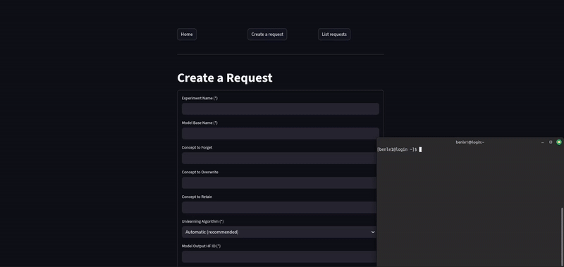
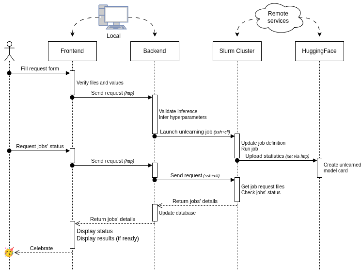
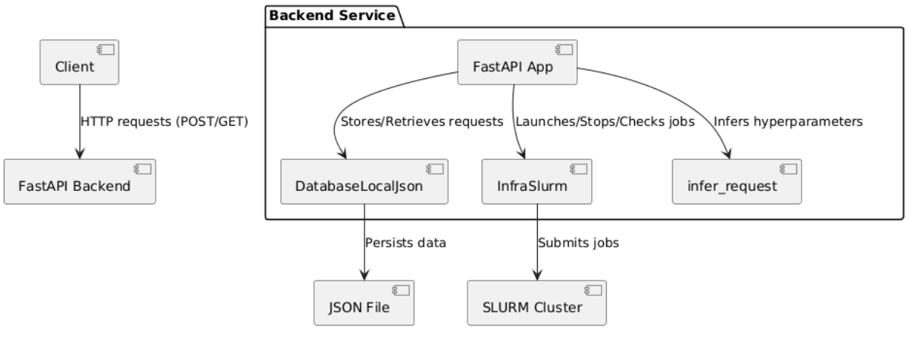
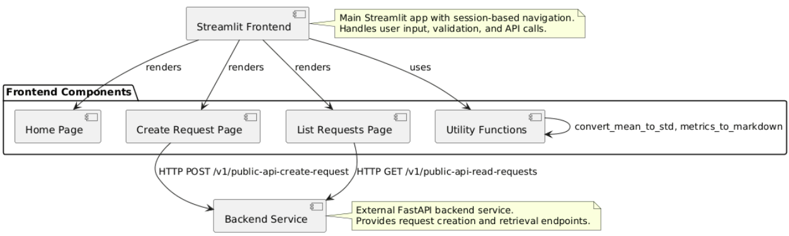
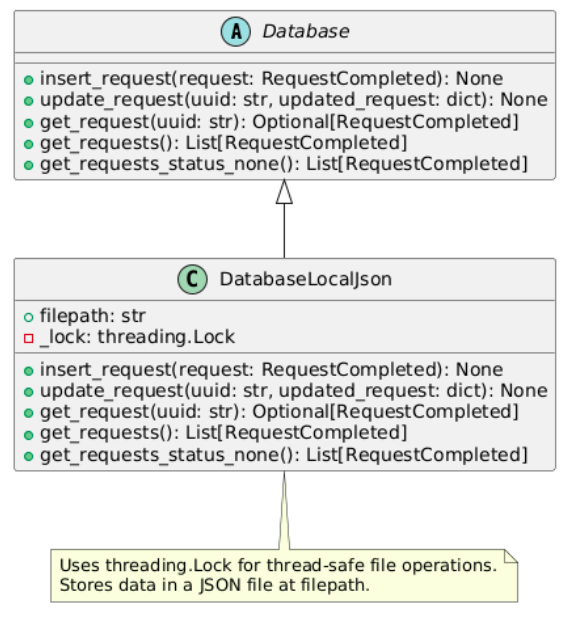
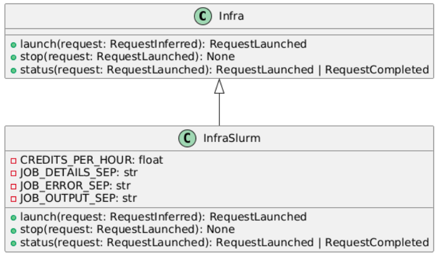
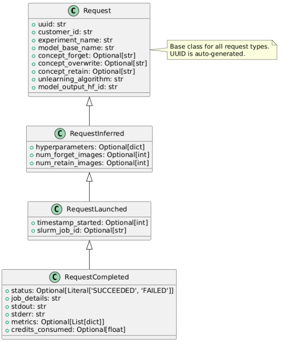

# Forgety

A web platform to democratize Machine Unlearning. Quick demo of the Forgetsy web UI in action (respectively exploring the results of a benchmark and running a new unlearnign session):




It enables experimenting with unlearning in a no-code manner, enabling a broader public (such as policy-makers, philosofers, among others) to exlore the benefits and shortcomings of Machine Unlearning.

It is built fully on top of the [Vision Unlearning](https://github.com/LeonardoSanBenitez/vision-unlearning) library, and the benchmark exploration feature is compatible with any HuggingFace repository whose structure follows Appendix 2 of I-CARE paper.


# Getting started

## Common setup (exploring benchmarks: listing entities, running Result Templates)
This path is *intended* to need **no `.env` file and no secrets at all** — forgety reads
benchmark data from a public HuggingFace repository anonymously.

> **Known open issue (as of this writing):** for any entity/task whose data isn't already
> cached locally, listing entities currently still fails with `Illegal header value
> b'Bearer '`, even with zero `.env`. Root cause is a `token=hf_token or ""` pattern in
> vision-unlearning (`metadata.py`, `result_templates.py`, `testbed.py`) that discards a
> correctly-`None` token right before the HF download call. Tracked in
> `PLAN-TASK-2026-07-13-ColleagueOnboarding.md`; remove this note once fixed and
> re-verified end to end.

1. Clone this repository and [vision-unlearning](https://github.com/LeonardoSanBenitez/vision-unlearning)
   as sibling directories — `docker-compose.yml`'s bind mounts require exactly this layout:
   ```
   parent/
   ├── forgety/            (this repository)
   └── vision-unlearning/
   ```
   (`vision-unlearning` is not installed as a Python package today; it's mounted directly
   from the sibling checkout. See the `TODO` comments in `docker-compose.yml` — publishing
   it to PyPI and dropping the mount is a separate, bigger task.)
2. From `forgety/`, run:
   ```bash
   docker compose up
   ```
3. Go to `http://localhost:8501`. Backend docs are at `http://localhost:8001/docs`.

This is also the starting point for running unlearning sessions (Slurm), below — that
path is a strict superset of this one, needing real credentials on top of it.

## Additional setup for running unlearning sessions (Slurm)
Running a *new* unlearning session (as opposed to exploring existing benchmark results)
needs real credentials: a HuggingFace token, to upload the resulting model, and
SSH/Slurm credentials, to submit the job to a cluster. Currently only a Slurm cluster is
supported as the execution backend.

1. Copy `.env.template` to `.env` and fill in `HF_TOKEN` plus the SSH/Slurm variables
   (see the template for the exact keys expected).
2. The same `.env` content is needed in three locations, all git-ignored:
   * `.env` — used by `docker compose` (via `env_file`) for the services running locally.
   * `infra/.env` — needed because the HF credential must also be available to the code
     that runs *on the cluster*, to allow uploading the resulting model.
   * `services/backend/app/.env` — needed for the backend to connect to Slurm.
3. Server-side setup: a server must be configured to actually execute the job (currently
   only Slurm clusters are supported). Our setup was tested on the PPKE's ITK HPC cluster
   (Esztergom) in December 2025, with:
   * Tesla V100-PCIE-16GB with CUDA Version: 12.6
   * Slurm 23.11.4
   * RHEL/CentOS/Fedora 8.10 (Green Obsidian)
   * vision-unlearning 0.1.6 with Python 3.10

## Testing
Tests run automatically on GitHub Actions for every push and pull request (`.github/workflows/test.yml`): mypy, pycodestyle, and the offline pytest suite (backend API tests, I-CARE route tests, and Streamlit UI tests via `streamlit.testing.v1.AppTest` — no browser or running backend needed).

To run them locally:

```bash
make test          # inside Docker (mypy + pycodestyle + offline pytest)
```

or on the host, with the dependencies from `services/backend/requirements.txt`, `services/frontend/requirements.txt`, `libs/requirements.txt` and `libs/requirements.dev.txt` installed, and a checkout of [vision-unlearning](https://github.com/LeonardoSanBenitez/vision-unlearning) as a sibling directory of this repository:

```bash
python -m pytest tests -m "not gpu and not integration"
```

Tests marked `integration` download real I-CARE data from HuggingFace; they are excluded from all default runs and executed weekly (or on demand) by `.github/workflows/integration.yml`.

## Tech stack
* **Automation and devops**: Docker, makefile, mypi, PEP8, pytest, pypi, readthedocs, git, github (issues and task board)
* **Frontend**: Streamlit, python
* **Backend**: FastAPI, pydantic, jsonschema, python
* **Infrastructure and cluster integration**: SSH, bash, Slurm commands, apptainer

# Architecture












